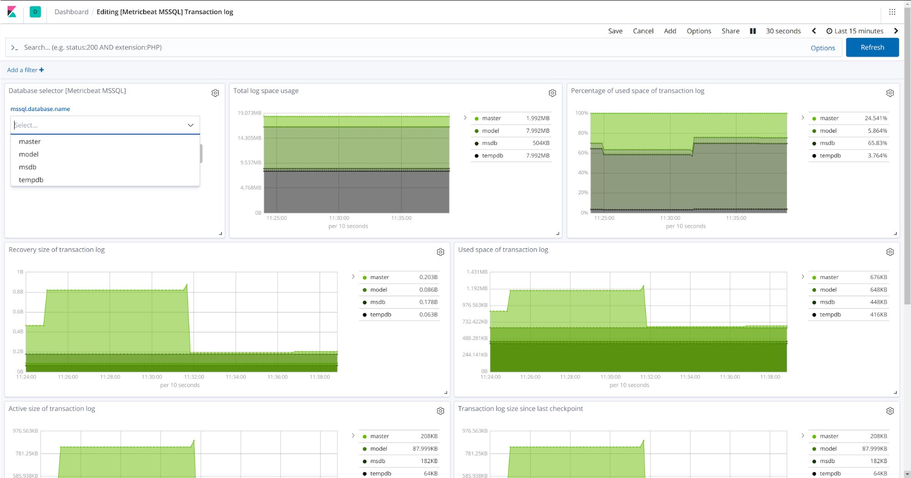

Note: This integration is in beta!

The MSSQL integration allows to monitor the SQL server and fetch logs. 




# Compatibility

This version is tested with SQL Server 2017.

# Configuration

TODO: Add docs on how to configure SQL server if any special configs needed.

If haven't setup the agent yet, checkout the docs here. To manually configure the agent, use the following configuration.
```
inputs:
- type: log
  paths: "/var/opt/mssql/log/error*"
  pipeline: mssql-access-pipeline

- type: metric/mssql
  metricsets: ["transaction_log", "performance"]
  period: 10s
  enabled: true
  hosts: ["sqlserver://sa@localhost"]
```


  
# Logs

| Field  Name               | Description                                             |
|----------------------------|---------------------------------------------------------|
| mssql.log.origin           | Origin of the log event                                 |
| message                    | Message from the access log                             |

An example event looks as following:

<details>
    <summary>Click to expand</summary>
        
```
{
    "@timestamp": "2019-05-03T09:01:09.990Z",
    "ecs.version": "1.0.0",
    "event.dataset": "mssql.log",
    "event.module": "mssql",
    "event.timezone": "+00:00",
    "fileset.name": "log",
    "input.type": "log",
    "log.flags": [
        "multiline"
    ],
    "log.offset": 0,
    "log.original": "2019-05-03 09:01:09.99 Server      Microsoft SQL Server 2017 (RTM-CU13) (KB4466404) - 14.0.3048.4 (X64)\n\tNov 30 2018 12:57:58\n\tCopyright (C) 2017 Microsoft Corporation\n\tDeveloper Edition (64-bit) on Linux (Ubuntu 16.04.5 LTS)",
    "message": "Microsoft SQL Server 2017 (RTM-CU13) (KB4466404) - 14.0.3048.4 (X64)",
    "mssql.log.origin": "Server",
    "service.type": "mssql"
}
```
</details>

# Metrics

## Performance metrics

The first thing that any user will want to look at is, as you have probably guessed, performance. 
It is very important is track the number of transactions, connected users, and cache hits, and all of this 
is included in this metricset. These metrics are retrieved from Performance Counters in Microsoft SQL Server

| Metric  Name               | Description                                             |
|----------------------------|---------------------------------------------------------|
| user_connections           | Total number of user connections                        |
| logins_per_sec             | Total number of logins started per second               |
| connections_reset_per_sec  | Total number of logins started from the connection pool |
| transactions               | Total number of transactions                            |

For an example event, click below.

<details>
    <summary>Click to expand</summary>
        
```
{
    "@timestamp": "2017-10-12T08:05:34.853Z",
    "agent": {
        "hostname": "host.example.com",
        "name": "host.example.com"
    },
    "event": {
        "dataset": "mssql.performance",
        "duration": 115000,
        "module": "mssql"
    },
    "metricset": {
        "name": "performance"
    },
    "mssql": {
        "performance": {
            "active_temp_tables": 0,
            "batch_requests_per_sec": 24249,
            "buffer": {
                "cache_hit": {
                    "pct": 0.14
                },
                "checkpoint_pages_per_sec": 182,
                "database_pages": 1892,
                "page_life_expectancy": {
                    "sec": 8201
                },
                "target_pages": 3194880
            },
            "compilations_per_sec": 7379,
            "connections_reset_per_sec": 2179,
            "lock_waits_per_sec": 3,
            "logins_per_sec": 7346,
            "logouts_per_sec": 7339,
            "page_splits_per_sec": 45,
            "recompilations_per_sec": 0,
            "transactions": 0,
            "user_connections": 7
        }
    },
    "service": {
        "address": "172.26.0.2",
        "type": "mssql"
    }
}
```

</details>


## Transaction Log metrics

This is another key metricset to include in your monitoring, because it helps you understand the shape and size of the server log. Some of the key metrics included here are:

| Metric  Name               | Description                                             |
|----------------------------|---------------------------------------------------------|
| space_usage           | This shows space usage information about the transaction log, a key metric to understand the performance of a Microsoft SQL Server. It also shows the time passed since the last backup of the log, useful for disaster recovery                       |
| stats             | This returns summary level attributes and information on transaction log files of databases. Use this information for monitoring and diagnostics of transaction log health. Here you can see active size, total size, or backup time for example.               |

An example event looks as following:

<details>
    <summary>Click to expand</summary>
        
```
{
    "@timestamp": "2017-10-12T08:05:34.853Z",
    "agent": {
        "hostname": "host.example.com",
        "name": "host.example.com"
    },
    "event": {
        "dataset": "mssql.transaction_log",
        "duration": 115000,
        "module": "mssql"
    },
    "metricset": {
        "name": "transaction_log"
    },
    "mssql": {
        "database": {
            "id": 1,
            "name": "master"
        },
        "transaction_log": {
            "space_usage": {
                "since_last_backup": {
                    "bytes": 135168
                },
                "total": {
                    "bytes": 2088960
                },
                "used": {
                    "bytes": 622592,
                    "pct": 29.80392074584961
                }
            },
            "stats": {
                "active_size": {
                    "bytes": 135167.737856
                },
                "backup_time": "1900-01-01T00:00:00Z",
                "recovery_size": {
                    "bytes": 0.128906
                },
                "since_last_checkpoint": {
                    "bytes": 135167.737856
                },
                "total_size": {
                    "bytes": 2088959.475712
                }
            }
        }
    },
    "service": {
        "address": "172.26.0.2",
        "type": "mssql"
    }
}
```

</details>

## Questions & Contributions

The development of the MSSQL integration and it's source code can be found here. If you found some missing fields or wrong fields, please open a Github issue or PR here. For questions, use our discuss forum.
